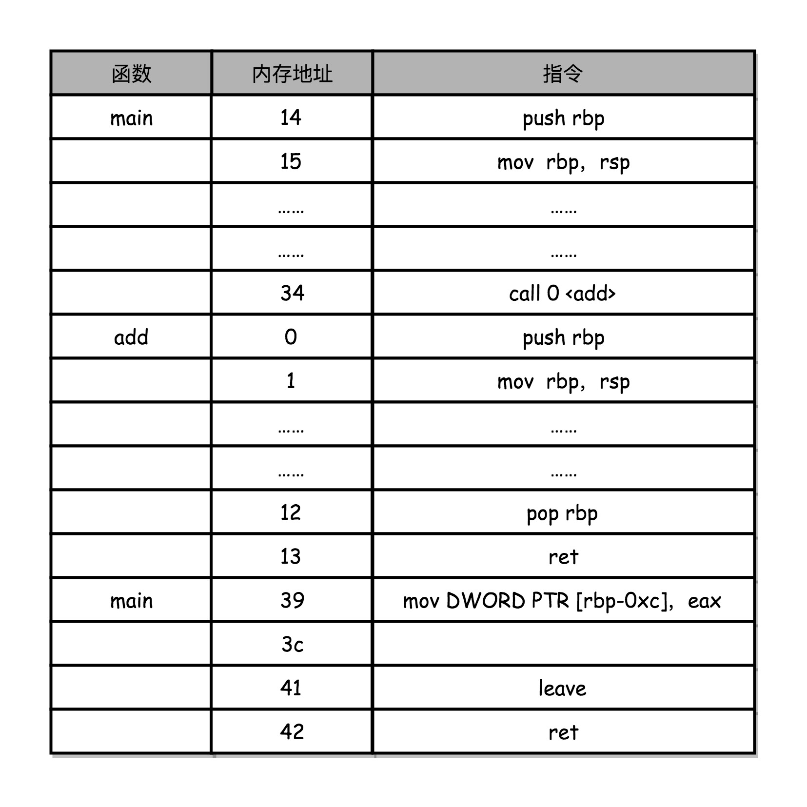

# 1.入门

## 学习方法

* 越早去弄清楚计算机的底层原理，在你的知识体系中“储蓄”起这些知识，也就意味着你有越长的时间来收获**学习知识的“利息”。**虽然一开始可能不起眼，但是随着时间带来的复利效应，你的长线投资项目，就能让你在成长的过程中越走越快。
* 计算机组成原理，既隔离了软件和硬件，也提供了让软件无需关心硬件，就能直接操作硬件的接口
  * 明白了高级语言是如何对应着 CPU 能够处理的一条条指令，能为你打开编译原理这扇门；
  * 搞清楚程序是如何加载运行的，能够让你对操作系统有更深入的理解。


* 学习难点：概念多，信息量，需要深入学习，跟平时联系不紧密
* 课程设计
  * 理论和在应用开发和架构设计中遇到的实际案例结合
  * 利用生活中的东西说明计算机的各个组件
  * 多讲一些计算机硬件发展史上的成功和失败
  * 把整个的计算机组成原理通过指令、计算、CPU、存储系统和 I/O 串起来。通过一个程序的执行过程进行逐层分解，让你能对整个系统有一个全貌的了解。
* 操作系统，其实是在“组成原理”所讲到的“指令集”上的一层封装。


##  冯·诺依曼体系结构

* 装机
  * CPU
  * 内存
  * 主板：
    * 主板是一个有着各种各样，有时候多达数十乃至上百个插槽的配件。
    * 我们的 CPU 要插在主板上，内存也要插在主板上。
    * 主板的**芯片组（Chipset）和总线（Bus）解决了 CPU 和内存之间如何通信的问题**。
      * 芯片组控制了数据传输的流转，也就是数据从哪里到哪里的问题。
      * 总线则是实际数据传输的高速公路。因此，总线速度（Bus Speed）决定了数据能传输得多快。
  * IO设备
    * 作为外部 I/O 设备，它们是通过主板上的南桥（SouthBridge）芯片组，来控制和 CPU 之间的通信的
    * 现在的主板上的“北桥”芯片的工作，已经被移到了 CPU 的内部
  * 硬盘
  * 显卡
    * 显卡里有除了 CPU 之外的另一个“处理器”，也就是GPU（Graphics Processing Unit，图形处理器）

* 手机
  * 把 CPU、内存、网络通信，乃至摄像头芯片，都封装到一个芯片，然后再嵌入到手机主板上。这种方式叫**SoC**，也就是 System on a Chip（系统芯片）
* 计算机都遵循了同一个体系结构：冯·诺依曼体系结构 -- 存储程序计算机
  * 2个概念：可编程  存储
    * 可编程：计算机是由各种门电路组合而成的，然后通过组装出一个固定的电路版，来完成一个特定的计算程序
    * 存储：程序本身是存储在计算机的内存里，可以通过加载不同的程序来解决不同的问题
  * 冯诺依曼：First Draft里面说了一台计算机应该有哪些部分组成
    * 处理器：包含算数逻辑单元、处理器寄存器。也叫作数据通路或者运算器
    * 控制器：指令寄存器 程序计数器。
      * 处理器和控制器组成了CPU
    * 内存：存储数据和指令
    * 外部存储：硬盘
    * 输入输出设备
  * 任何一台计算机的任何一个部件都可以归到运算器、控制器、存储器、输入设备和输出设备中，而所有的现代计算机也都是基于这个基础架构来设计开发的


* 小结
  * 学习组成原理，其实就是学习**控制器、运算器**的工作原理，也就是 CPU 是怎么工作的，以及为何这样设计；
  * 学习内存的工作原理，从最基本的电路，到上层抽象给到CPU 乃至应用程序的接口是怎样的；
  * 学习 CPU 是怎么和输入设备、输出设备打交道的。
  * 学习组成原理，就是在理解从控制器、运算器、存储器、输入设备以及输出设备，从电路这样的硬件，到最终开放给软件的接口，是怎么运作的，为什么要设计成这样，以及在软件开发层面怎么尽可能用好它。
    * **学习硬件给软件开放的接口是怎么运行、设计、如何使用**

* 问题

  * 图灵机和冯·诺依曼机是两种不同的计算机么？图灵机是一种什么样的计算机抽象呢？

    * 并**不是两种计算机**，他们只是描述的侧重点不同而已
    * 冯·诺依曼机侧重于硬件抽象，而图灵机侧重于计算抽象
    *  图灵机是一种思想模型（计算机的基本理论基础），是一种有穷的、构造性的问题的问题求解思路，图灵认为凡是能用算法解决的问题也一定能用图灵机解决
    * 冯诺依曼提出了“存储程序”的计算机设计思想，并“参照”图灵模型设计了历史上第一台电子计算机，即冯诺依曼机。

    * 冯诺依曼确定了当代计算机体系结构，即五大部件（运算器、控制器、存储、输入设备、输出设备）；程序存储；二进制运算方式；构建了一个可编程、可存储的计算机硬件体系，为软件编程构建了逻辑抽象的计算机模型。
      阿兰图灵确定了利用当代计算机的计算极限，即冯诺依曼机只能解决1.有解的可计算的数学问题2.能够在有限步骤得到解；为软件编程确立的问题域边界。

  * 图灵机是一个很有意思的抽象问题，背后对应着一门<可计算性理论>的课程，其实就是告诉我们什么样的问题是计算机解决得了的，什么样的问题是解决不了的。而lambda算子是构造图灵机表示的一个数学的形式化系统。想要和实践结合的话，最好是去刷一刷sicp这本书，也就是<计算机程序的构造与解释>

  * 哈弗结构算是冯诺依曼结构的一个特殊形式吧，把指令和数据分开存储

  * 冯诺依曼机和图灵机可谓是计算机的一体两面，如果我们把“图灵机”当成是“灵魂”代表了计算机最抽象的本质，那么“冯诺伊曼机”就是“肉体”代表了计算机最具体的本质。

## 知识地图

* 整个计算机组成原理，就是围绕着计算机是如何组织运作展开的。


* 计算机基本组成
  * 哪些硬件组成：运算器、控制器、存储器、输入设备和输出设备
  * 核心指标：性能和功耗
* **计算机指令和运算：编译过程、执行过程、算术过程**
  * 程序是怎么通过编译器和汇编器，变成一条条机器指令这样的编译过程
  * 操作系统是怎么链接、装载、执行这些程序的。
    * 执行是控制器完成的。
  * 算术逻辑单元 ALU
    * 浮点数：掌握浮点数能让你对数据的编码、存储和计算能够有一个从表到里的深入理解
* **处理器设计：时钟、设计思路、中断和异常、并行执行**
  * CPU 时钟可以用来构造寄存器和内存的锁存器和触发器
  * 计算机的数据通路是如何构造出来的
    * 数据通路，其实就是连接了整个运算器和控制器，并最终组成了 CPU
    * 面向流水线设计的 CPU、数据和控制冒险，以及分支预测的相关技术
  * 异常和中断发生的机制
  * 指令的并行执行：如何直接在 CPU 层面，通过SIMD 来支持并行计算
* **存储和IO系统：硬件的工作原理、通信过程、性能问题、数据完整性**
  * 掌握从上到下的 CPU 高速缓存、内存、SSD 硬盘和机械硬盘的工作原理，它们之间的性能差异
  * 存储器也作为IO设备，需要了解存储器之间是如何进行通信的，以及我们最重视的性能问题是怎么一回事；理解什么是 IO_WAIT，如何通过 DMA 来提升程序性能。
  * 通过 RAID、Erasure Code、ECC 以及分布式 HDFS保证数据的完整性

* 深入挖掘课程
  * 程序怎样从高级代码变成指令在计算机里面运行，对应着“编译原理”和“操作系统”这两门课程；
  * 计算实现背后则是“数字电路”；
  * 如果要深入 CPU 和存储器系统的优化，必然要深入了解“计算机体系结构

* 在组成原理里面说的中断，一般指的是**硬件的中断**，是硬件设备会向我们的CPU发出信号，这个是直接通过硬件电路层面来触发。就好像一个电路引脚的信号从高电平变成了低电平，导致CPU收到的电信号就发生了变化，通常是改变了特定寄存器里面的值（中断寄存器），再触发一系列的处理逻辑。


## 计算机的性能

* 计算机性能的衡量指标

  * 响应时间/执行时间
    * 我们执行一个程序，到底需要花多少时间。
  * 吞吐率或者带宽
    * 我们在一定的时间范围内，到底能处理多少事情
  * 缩短程序的响应时间，一般来说都会提升吞吐率
  * 提升吞吐率：加机器

* 一般把性能，定义成响应时间的倒数：性能 = 1/ 响应时间

  * 响应时间越短，性能的数值就越大
  * 手机跑分：把多个预设好的程序在手机上运行，然后根据运行需要的时间，算出一个分数来给出手机的性能评估。
    * 监测到跑分程序在运行进行超频或者过热也不降频是一种常见的作弊手段

* 计算机的计时单位：CPU 时钟

  * 要想准确统计某个程序运行时间，进而去比较两个程序的实际性能，我们得上下文切换时间、程序等待时间等给刨除掉
  * Linux 下有一个叫 time 的命令，可以帮我们统计出来。程序实际在 CPU 上到底花了多少时间

  ```shell
  [home@localhost ~]$ time seq 1000000 | wc -l
  1000000
  
  real	0m0.621s
  user	0m0.577s
  sys	0m0.006s
  
  第一个是real time，也就是我们说的Wall Clock Time，也就是运行程序整个过程中流逝掉的时间；
  第二个是user time，也就是 CPU 在运行你的程序，在用户态运行指令的时间；
  第三个是sys time，是 CPU 在运行你的程序，在操作系统内核里运行指令的时间。
  
  而程序实际花费的 CPU 执行时间（CPUTime），就是 user time 加上 sys time。
  
  在一台多核或者多cpu的机器上运行，seq和wc命令会分配到两个cpu上，user和sys是两个cpu时间相加的，而real只是现实时钟里走过的时间
  
  虽然seq和wc这两个命令都是单线程运行的，但是这两个命令在多核cpu运行的情况下，会分别分配到两个不同的cpu
  ```

* 即使我们已经拿到了 CPU 时间，我们也不一定可以直接“比较”出两个程序的性能差异。即使在同一台计算机上，CPU 可能满载运行也可能降频运行，降频运行的时候自然花的时间会多一些。

* 除了 CPU 之外，时间这个性能指标还会受到主板、内存这些其他相关硬件的影响。

* 因此对时间进行拆解：**程序的 CPU 执行时间 =CPU 时钟周期数×时钟周期时间**

  * 时钟周期时间: 晶体振荡器的一次度量 = 1/主频  。1G其实就是10亿次
    * 主频越高，意味着这个表走得越快，我们的CPU 也就“被逼”着走得越快。
    * 提升性能 - 提升主频 -升级硬件CPU
  * CPU 时钟周期数 = 指令数×每条指令的平均时钟周期数（CPI）
  * 最终：**程序的 CPU 执行时间 = 指令数×CPI×Clock Cycle Time**
    * 时钟周期时间，就是计算机主频，这个取决于计算机硬件
    * 每条指令的平均时钟周期数 CPI，就是一条指令到底需要多少 CPU Cycle
      * 现代的 CPU 通过流水线技术（Pipeline），让一条指令需要的 CPU Cycle 尽可能地少
    *  指令数，代表执行我们的程序到底需要多少条指令、用哪些指令-- 主要看编译器
      * 指令数相当于你的程序设计得够合理，同样的程序要写的代码行数就少

* 优化手段
  * 提升计算机主频，
  * 优化 CPU 设计使得在单个时钟周期内能够执行更多指令，
  * 以及通过编译器来减少需要的指令数。

* 精简指令集意味着**cpu从硬件或者电路层面支持的指令数比较少**。这个意味着很多复杂的操作需要执行更多的指令而不是更少的。执行效率这个问题更复杂一些，精简指令也许更容易提高频率或者利用流水线等等，只能说具体问题具体分析。现在更多地是出于一个“混合”的状态


## 提升性能

* **程序的 CPU 执行时间 = 指令数×CPI×Clock Cycle Time**

* 最开始的优化，提升CPU
  * 可以增加晶体管 和 提升主频，都会带来功耗和散热的问题
  * 如果 CPU 的面积大，晶体管之间的距离变大，电信号传输的时间就会变长，运算速度自然就慢了
  * 功耗计算：功耗 ~= 1/2 ×负载电容×电压的平方×开关频率×晶体管数量
    * 降低晶体管的大小 -- 提升“制程
    * 功耗增加太多，就会导致 CPU 散热跟不上，这时，我们就需要降低电压。但是功耗和电压的平方是成正比的
      * 从 5MHz 主频的 8086 到 5GHz 主频的 Intel i9，CPU 的电压已经从 5V 左右下降到了 1V 左右
      * 低压版笔记本,原来是电压的平方和功耗是正比的,也就是电压的降低对于功耗来说,降低效益最好。超薄本通过抵押降低功耗，
  * 最终：制程的优化和电压的下降，来提升性能
* 并行优化，理解阿姆达尔定律
  * 多核 CPU，通过提升“吞吐率”而不是“响应时间”，提升性能 -- 通过并行提高性能。
  * 并行的条件
    * 任务可分解
    * 分解计算结果能汇总
    * 汇总的过程还是串行
  * 这里面有一个经验定律：阿姆达尔定律
    * 优化后的执行时间 = 受优化影响的执行时间 / 加速倍数 + 不受影响的执行时间


* 在“摩尔定律”和“并行计算”之外，在整个计算机组成层面，还有这样几个原则性的性能提升方法
  * 加速大概率事件
    * 缓存机制，提高平均概率下的性能
      * 内存缓存
    * 编译热点代码
  * 通过流水线提高性能：把 CPU 指令执行的过程进行拆分，细化运行
    * 并发编程、异步编程
  * 通过预测提高性能：后面要讲的“分支和冒险”、“局部性原理”这些 CPU 和存储系统设计方法，其实都是在利用我们对于未来的“预测”
    * 通过预测集合大小,来定义集合初始化容量.
* **增加晶体管可以增加硬件能够支持的指令数量**，增加数字通路的位数，以及利用好电路天然的并行性，从硬件层面更快地实现特定的指令，所以增加晶体管也是常见的提升cpu性能的一种手段。
  * 增加晶体管数量，其实是通过提供更复杂的电路支持更多的“指令”。也就会减少运行同样程序需要的指令数。
* 电压的问题在于两个，**一个是电压太低就会导致电路无法联通**，因为不管用什么作为电路材料，都是有电阻的，所以没有办法无限制降低电压，另外一个是对于**工艺的要求**也变高了，成本也更贵啊。


# 2.指令和运算

## 计算机指令

* 从硬件的角度来看，CPU 就是一个超大规模集成电路，通过电路实现了加法、乘法乃至各种各样的处理逻辑。
* 从软件看，CPU 就是一个执行各种计算机指令的逻辑机器。
  * 计算机指令 就是机器语言，不同的CPU有不同的计算机指令集，有相同的指令集，才能运行相同的程序
  * 存储程序型计算机：程序指令存储在存储器里面
  * 还有一种是插线板计算机
* 代码是怎么执行的
  * 编译：把整个程序翻译成一个汇编语言

```
[machine@as1 test]$ vim test.c
  1 // test.c
  2 int main()
  3 {
  4 int a = 1;
  5 int b = 2;
  6 a = a + b;
  7 }
                                                                        
[machine@as1 test]$ gcc -g -c test.c 
[machine@as1 test]$ objdump -d -M intel -S test.o 
test.o:     file format elf64-x86-64
Disassembly of section .text:
0000000000000000 <main>:
// test.c
int main()
{
   0:	55                   	push   rbp
   1:	48 89 e5             	mov    rbp,rsp
int a = 1;
   4:	c7 45 fc 01 00 00 00 	mov    DWORD PTR [rbp-0x4],0x1
int b = 2;
   b:	c7 45 f8 02 00 00 00 	mov    DWORD PTR [rbp-0x8],0x2
a = a + b;
  12:	8b 45 f8             	mov    eax,DWORD PTR [rbp-0x8]
  15:	01 45 fc             	add    DWORD PTR [rbp-0x4],eax
}
  18:	5d                   	pop    rbp
  19:	c3                   	ret 
  
左侧有一堆数字，这些就是一条条机器码；
右边有一系列的 push、mov、add、pop 等，这些就是对应的汇编代码
程序代码可能对应多个汇编代码。汇编代码其实就是“给程序员看的机器码”。可以直接编译成机器代码
汇编代码和机器码之间是一一对应的
```


* 指令：日常用的 Intel CPU，有 2000 条左右的 CPU 指令
  * 第一类是算术类指令。我们的加减乘除，在 CPU 层面，都会变成一条条算术类指令。
  * 第二类是数据传输类指令。给变量赋值、在内存里读写数据，用的都是数据传输类指令。
  * 第三类是逻辑类指令。逻辑上的与或非，都是这一类指令。
  * 第四类是条件分支类指令。日常我们写的“if/else”，其实都是条件分支类指令。
  * 最后一类是无条件跳转指令。在调用函数的时候，其实就是发起了一个无条件跳转指令。


* 汇编器是怎么把对应的汇编代码，翻译成为机器码的（使用最简单的 MIPS 指令集）
* MIPS 的指令是一个 32 位的整数，高 6 位叫操作码（Opcode），也就是代表这条指令具体是一条什么样的指令，剩下的 26 位有三种格式，分别是 R、I 和 J
  * R 指令是一般用来做算术和逻辑操作，里面有读取和写入数据的寄存器的地址
  * I 指令，则通常是用在数据传输、条件分支，以及在运算的时候使用的并非变量还是常数的时候。
  * J 指令就是一个跳转指令，高 6 位之外的 26 位都是一个跳转后的地址
  * add $t0,$s2,$s1
    * add在指令集用高6位表示
    * rs -- s1的地址，rt--s2的地址，rd-- t0的地址，从后往前
    * 表示完成这些只会，转化为二进制，就能制作打孔带了

* 

* 这一讲里，我们看到了一个 C 语言程序，是怎么被编译成为汇编语言，乃至通过汇编器再翻译成机器码的。
  * 解释型语言，是通过解释器在程序运行的时候逐句翻译，
  * 而 Java 这样使用虚拟机的语言，则是由虚拟机对编译出来的中间代码进行解释，或者即时编译成为机器码来最终执行。
* 不同指令集里，对应的汇编代码会对应这个指令集的机器码
  * “汇编语言”其实可以理解成“机器码”的一种别名或者书写方式，不同的指令集和体系结构的机器会有不同的“机器码”
  * 以最复杂的Intel X86的指令集为例，也只有2000条不同的指令而已。
* 因为纯粹靠提升频率硬件的方法已经没有什么空间了，所以其实又进入了优化指令集乃至整个体系结构的阶段了

Java 就是 编译成字节码 + 虚拟机
python 就是 解释器
C 就是编译成 机器码


## 	指令跳转

* 逻辑上，我们可以认为，CPU 其实就是由一堆寄存器组成的。而寄存器就是 CPU 内部，由多个触发器（Flip-Flop）或者锁存器（Latches）组成的简单电路
  * PC寄存器，就是指令寄存器。存放下一条需要执行的计算机指令的内存地址
  * 指令寄存处：存放当前正在执行的指令
  * 条件码寄存器，用里面的一个一个标记位（Flag）存放计算结果
  * 有些寄存器既可以存放数据，又能存放地址，我们就叫它通用寄存器。


* 为什么说指令是一条一条顺序执行的？
  * 一个程序执行的时候，CPU 会根据 PC 寄存器里的地址，从内存里面把需要执行的指令读取到指令寄存器里面执行，然后根据指令长度自增，开始顺序读取下一条指令
  * **跳转指令，会修改 PC 寄存器里面的地址值**。这样，下一条要执行的指令就不是从内存里面顺序加载的了
* if判断的2个指令
  *  cmp:比较大小 
  * jne：jump if not equal. 判断不一样，就向else跳转，在纸带上就是忽略下面的几行孔
  * jle指令并不是和2做比较，而是**判断标志位的**，jle 和 jl 用的是不同的标志位，
* 循环
  * cmp
  * jle  判断小于就跳转
* CPU的指令是怎么执行的？
  * 除了简单地通过 PC 寄存器自增的方式顺序执行外，
  * 条件码寄存器会记录下当前执行指令的条件判断状态，然后通过跳转指令读取对应的条件码，修改 PC 寄存器内的下一条指令的地址，最终实现 if…else 以及 for/while 这样的程序控制流程。
* 硬件层面是怎么实现循环和判断的
  * 想要在硬件层面实现这个 goto 语句，除了本身需要用来保存下一条指令地址，以及当前正要执行指令的 **PC 寄存器、指令寄存器**外，
  * 我们只需要再增加一个**条件码寄存器**，来保留条件判断的状态。这样简简单单的三个寄存器，就可以实现条件判断和循环重复执行代码的功能。
* 如果没有提供返回值，很多版本的编译器会隐式地生成一个return 0;的返回值，
* case 语句是否跟if else 一样？
  * switch case 要看编译器有没有生成跳表，没有的话跟if else效率应该是一样的
* 二进制可执行文件里面除了指令信息之外还有很多别的信息


## 函数调用

```shell
[machine@as1 test]$ cat test7.c 
#include <stdio.h>
int static add(int a, int b)
{
return a+b;
}
int main()
{
int x = 5;
int y = 10;
int u = add(x, y);
}


[machine@as1 test]$ objdump -d -M intel -S test7.o 

test7.o:     file format elf64-x86-64
Disassembly of section .text:
0000000000000000 <add>:
#include <stdio.h>
int static add(int a, int b)
{
   0:	55                   	push   rbp
   1:	48 89 e5             	mov    rbp,rsp
   4:	89 7d fc             	mov    DWORD PTR [rbp-0x4],edi
   7:	89 75 f8             	mov    DWORD PTR [rbp-0x8],esi
return a+b;
   a:	8b 45 f8             	mov    eax,DWORD PTR [rbp-0x8]
   d:	8b 55 fc             	mov    edx,DWORD PTR [rbp-0x4]
  10:	01 d0                	add    eax,edx
}
  12:	5d                   	pop    rbp
  13:	c3                   	ret    

0000000000000014 <main>:
int main()
{
  14:	55                   	push   rbp
  15:	48 89 e5             	mov    rbp,rsp
  18:	48 83 ec 10          	sub    rsp,0x10
int x = 5;
  1c:	c7 45 fc 05 00 00 00 	mov    DWORD PTR [rbp-0x4],0x5
int y = 10;
  23:	c7 45 f8 0a 00 00 00 	mov    DWORD PTR [rbp-0x8],0xa
int u = add(x, y);
  2a:	8b 55 f8             	mov    edx,DWORD PTR [rbp-0x8]
  2d:	8b 45 fc             	mov    eax,DWORD PTR [rbp-0x4]
  30:	89 d6                	mov    esi,edx
  32:	89 c7                	mov    edi,eax
  34:	e8 c7 ff ff ff       	call   0 <add>
  39:	89 45 f4             	mov    DWORD PTR [rbp-0xc],eax
}
  3c:	c9                   	leave  
  3d:	c3                   	ret    

```

* 调用函数用call 指令.call调用函数的时候，执行压栈和出栈操作
  * 压栈：push move
  * 出栈：pop ret
  * 函数调用的过程，就是入栈出栈的过程，递归调用多个函数，就是不断压栈，把函数调用的返回地址、参数数据等入栈。
  * 在栈里面一个函数所占用的所有内存空间，就是它的栈帧
  * 指令地址本身的压栈和出栈是在 call 和 ret 的部分进行的。
  * 函数调用call指令时，（PC）指令地址寄存器会自动压栈，即返回地址压栈，函数返回ret指令时会自动弹栈，即返回地址赋值给PC寄存器
* 函数调用类似 if判断和for循环：都是在原来顺序执行的指令过程里，执行了一个内存地址的跳转指令
  * 区别：函数调用跳转之后还回来。继续call之后的指令。
* 上面程序的入栈过程如下
  * 调用call指令时，会把当前的 PC 寄存器里的下一条指令的地址压栈，保留函数调用结束后要执行的指令地址。
  * 而 add 函数的第 0 行，push rbp 这个指令，就是在进行压栈。这里的 rbp 又叫栈帧指针（Frame Pointer），是一个存放了当前栈帧位置的
    寄存器。push rbp 就把之前调用函数，也就是 main 函数的栈帧的栈底地址，压到栈顶。
  * 在函数 add 执行完成之后，又会分别调用第 12 行的 pop rbp 来将当前的栈顶出栈，这部分操作维护好了我们整个栈帧。然后，我们可以调用第 13 行的 ret 指令，这时候同时要把 call 调用的时候压入的 PC 寄存器里的下一条指令出栈，更新到 PC 寄存器中，将程序的控制权返回到出栈后的栈顶



* 栈的大小也是有限的。如果函数调用层数太多，我们往栈里压入它存不下的内容，程序在执行的过程中就会遇到栈溢出的错误，这就是大名鼎鼎的“stack overflow”

  * 让函数 A 调用自己，并且不设任何终止条件
  * 递归层数过深
  * 在栈空间里面创建非常占内存的变量 -- 大数组

* 函数内联：把一个实际调用的函数产生的指令，直接插入到的位置，来替换对应的函数调用指令

  * 函数优化的一种手段
  * 在 GCC 编译的时候，加上对应的一个让编译器自动优化的参数 -O。编译器会自动判断
  * 还可以在定义函数的地方，加上 inline 的关键字，来提示编译器对函数进行内联
  * 内联意味着，我们把可以复用的程序指令在调用它的地方完全展开了。如果一个函数在很多地方都被调用了，那么就会展开很多次，整个程序占用的空间就会变大了。
  * 内联在调用很多次的情况下会增加程序指令占用的空间大小 -- 没有被复用

* 叶子函数：没有调用其他函数，只会被调用的函数

  

* 在程序栈里面，除了我们跳转前的指令地址外，还需要保留哪些信息，才能在我们在函数调用完成之后，跳转回到指令地址的时候，继续执行完函数调用之后的指令呢？
*  java虚拟机其实是一个应用层的程序，java虚拟机的内部内存分配其实是在虚拟内存地址层面的分配。的确不涉及到操作系统和硬件层面的分页问题


## ELF和静态链接

